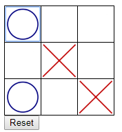

# TicTacToe Game in JavaScript

This is the TicTacToe game implemented in HTML/CSS/JavaScript.  I had originally written something similar in C# and decided to port it in order to practice JavaScript.

I also wanted to practice unit testing, and I chose QUnit because it was simple for beginners.

## Running the Game

Clone the repository, then double-click on the `index.html` file.

## Running the Unit Tests

Clone the repository, then double-click on the `tests.html` file.

## Supported Browsers

* Chrome
* Firefox
* IE 11